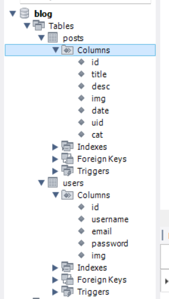
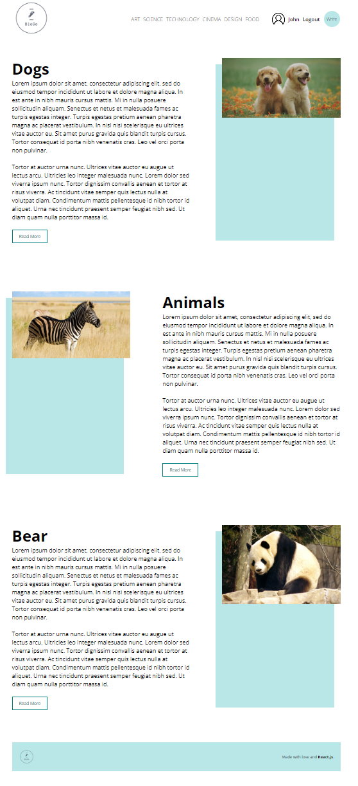
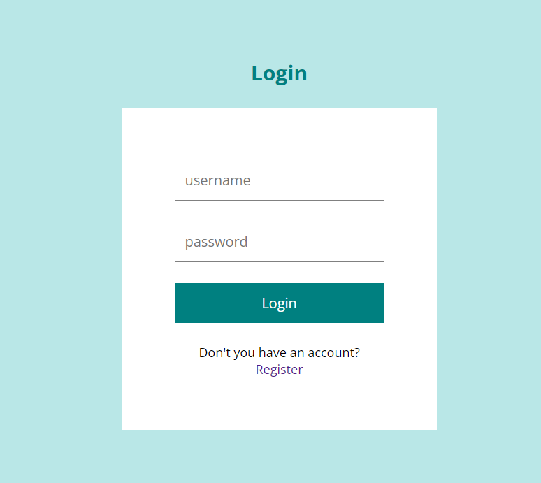
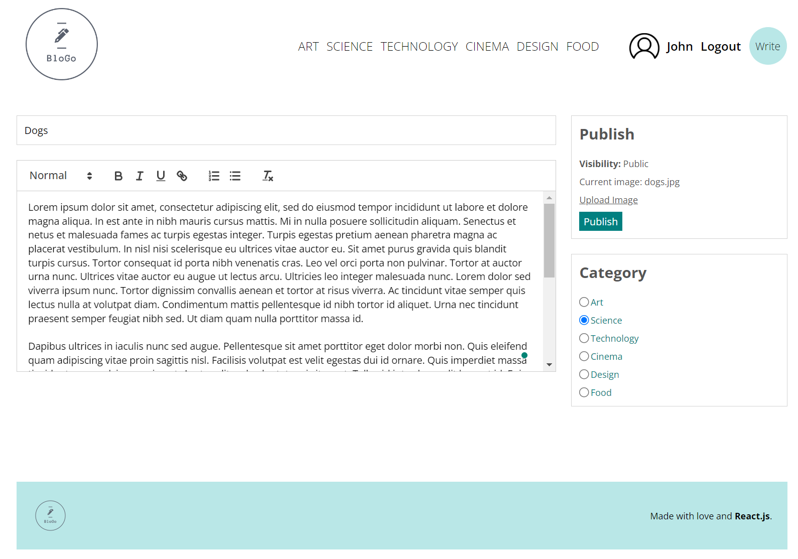
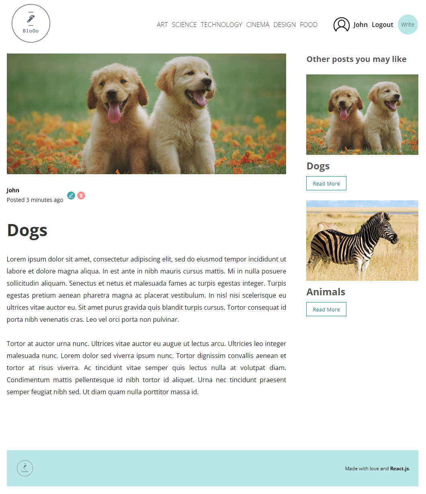

# Blog application
- The application includes a user registration and authentication service,
where, once logged in, a user is stored in context and can be used throughout
the website in order to perform different tasks
- A user can only delete or edit the posts that he has made
- Each post can be assigned a specific category, the website further allowing
users to filter posts by category and to see other recommended posts from the 
same category

## Technical aspects
- The website is created with React / Node.js
- All data is stored in a mysql database, with the exception of images, where the actual content is stored client side, and the mysql database only stores the url

</img>

- For REST requests, axios is being used
- Each posts has a rich text editor for its content
- The access token, created with JWT is stored in a cookie

   